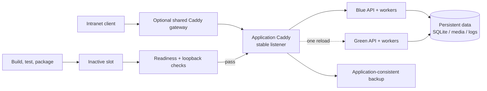

# Deploy Windows Intranet

Configuration-driven blue/green deployment automation for Node.js, Next.js, and Vite applications running on Windows 11 or Windows Server.

This project packages the operational knowledge normally hidden in one-off deployment scripts into a versioned, project-owned PowerShell Skill. It gives a small team a repeatable path from project audit to installation, release, rollback, backup, and handoff - without requiring Codex or a Linux/container platform in production.

> **Positioning:** this is single-host deployment resilience, not machine-level high availability. It reduces deployment-caused downtime, but it cannot remove power, disk, operating-system, or host-network failure modes.

## What it solves

- **Repeatable Windows operations** - deterministic PowerShell commands instead of interactive, undocumented server changes.
- **Near-zero-downtime releases** - an inactive blue/green slot is built and health-checked before one Caddy reload changes traffic.
- **Fast, explainable rollback** - immutable release directories and slot junctions preserve the previous known-good target.
- **Safe service boundaries** - Caddy is the stable entry point; WinSW manages API and worker processes as Windows services.
- **Data and secret separation** - application data, uploads, logs, backups, and secrets live outside release directories.
- **Multi-application hosting** - each application has a unique loopback Caddy admin port and can optionally publish a hostname route to a separately owned shared gateway.
- **Operational guardrails** - preflight checks, configuration validation, an operation mutex, loopback listener verification, memory guard, status warnings, and restore-drill guidance.

## Architecture



Each release is copied into an immutable directory. A `blue/current` or `green/current` junction identifies the release attached to a slot; active state is recorded separately. The old slot is drained after cutover and remains available as the rollback target.

## Core workflow

1. **Audit** the target project to discover framework, entry points, health candidates, build output, and persistent-storage signals.
2. **Scaffold** a project-owned `deploy/windows` package and an operator Runbook.
3. **Customize and validate** `deployment.config.json` against the application's real commands, paths, ports, health endpoint, and data contracts.
4. **Preflight** the host for elevation, port ownership, unique Caddy admin ports, tool availability, and planned firewall/power changes.
5. **Install** pinned Caddy and WinSW binaries, register services/tasks, and perform the first controlled cutover.
6. **Deploy** subsequent releases to the inactive slot, run tests/build/install, wait for readiness, reload Caddy once, and drain the old slot.
7. **Operate** with `status.ps1`, `backup.ps1`, `rollback.ps1`, and the generated Runbook.

## Quick start

Run these commands from an elevated PowerShell session on the target Windows host. The first four steps are read-only or generate files inside the application repository; installation is the state-changing step.

```powershell
# 1) Inspect the application
.\scripts\audit-project.ps1 -ProjectRoot C:\src\my-app

# 2) Generate the deployment package and Runbook
.\scripts\scaffold-project.ps1 -ProjectRoot C:\src\my-app -AppName "My Intranet App"

# 3) Edit C:\src\my-app\deploy\windows\deployment.config.json
#    and docs\WINDOWS_INTRANET_DEPLOYMENT.md for the real application.

# 4) Validate configuration and referenced files
.\scripts\validate-project.ps1 -ProjectRoot C:\src\my-app

# 5) Review host changes and resolve every blocking finding
.\deploy\windows\preflight.ps1 -ConfigPath C:\src\my-app\deploy\windows\deployment.config.json

# 6) Install services, Caddy, scheduled tasks, and the first release
.\deploy\windows\install.ps1 -ConfigPath C:\src\my-app\deploy\windows\deployment.config.json -ProjectRoot C:\src\my-app
```

For a normal code-only release:

```powershell
.\deploy\windows\deploy.ps1 -ConfigPath .\deploy\windows\deployment.config.json -ProjectRoot .
.\deploy\windows\status.ps1 -ConfigPath .\deploy\windows\deployment.config.json
```

Use `-AllowDirty` or `-SkipTests` only when the risk is intentional and documented in the Runbook. Configuration/service changes should go through `install.ps1` so obsolete services and scheduled tasks are reconciled.

## Configuration highlights

`deployment.config.json` is schema-versioned and kept in source control. It describes:

- pinned Caddy and WinSW versions with SHA-256 hashes;
- test, build, dependency-install, and release-copy commands;
- stable listener and per-slot API ports;
- API health paths, route ownership, bind-address environment variables, and graceful-stop timeouts;
- persistent-root and allowed-origin environment variables;
- worker memory limits and sustained-threshold Memory Guard policy;
- optional application-aware backup command and schedule;
- approved firewall remote addresses and AC power policies.

Secrets are referenced as machine-level environment variables (for example `%APP_DATABASE_URL%`) and are never written into JSON or WinSW XML in plaintext.

## Reliability and security model

- **Health-gated cutover:** an API must return a ready 2xx response and listen only on `127.0.0.1`/`::1` before it can receive traffic.
- **Atomic routing change:** frontend static assets and API routes switch in one validated Caddy reload.
- **Rollback preservation:** pre-switch failures restore the previous inactive-slot junction; post-cutover drain failures are persisted as explicit warnings.
- **Concurrency control:** install, deploy, and rollback share a host-wide mutex keyed by the canonical production root.
- **Service isolation:** every API/worker runs as a named WinSW service; wildcard/LAN-facing slot listeners are rejected.
- **Supply-chain checks:** downloaded binaries are accepted only when their pinned SHA-256 hashes match.
- **Narrow network exposure:** global firewall ranges such as `Any`, `0.0.0.0/0`, and `::/0` are rejected.
- **Recovery discipline:** SQLite backups must use the SQLite backup API or an application backup endpoint; raw file copies of a live database are not accepted.

## Schema migration

Schema v1 packages can be migrated safely to v2:

```powershell
# Dry run first
.\scripts\migrate-schema-v1-to-v2.ps1 -ProjectRoot C:\src\my-app

# Apply only from a clean Git worktree; creates a ZIP backup
.\scripts\migrate-schema-v1-to-v2.ps1 -ProjectRoot C:\src\my-app -Apply
```

The migration adds `bindAddressEnvironment` to API services, synchronizes the runtime scripts, validates the result, and automatically restores project files if post-write validation fails. It does not install services or change host settings.

## Verification

Run the isolated regression suite after modifying the Skill or its generated assets:

```powershell
.\scripts\test-skill.ps1
```

The suite exercises scaffolding, schema migration, configuration rejection, PowerShell parsing, loopback enforcement, operation locking, process-tree memory accounting, slot junction swaps, warning persistence, and obsolete-service detection. Production acceptance still requires a real scheduled-backup run and an isolated restore drill; see [`references/acceptance-checklist.md`](references/acceptance-checklist.md).

## Repository map

| Path | Purpose |
| --- | --- |
| [`SKILL.md`](SKILL.md) | Scope, workflow, operating rules, and handoff expectations |
| [`assets/windows-blue-green/`](assets/windows-blue-green/) | Project-owned runtime scripts and configuration template |
| [`scripts/audit-project.ps1`](scripts/audit-project.ps1) | Read-only project inventory |
| [`scripts/scaffold-project.ps1`](scripts/scaffold-project.ps1) | Generates `deploy/windows` and the Runbook |
| [`scripts/validate-project.ps1`](scripts/validate-project.ps1) | Validates a generated package and referenced files |
| [`scripts/migrate-schema-v1-to-v2.ps1`](scripts/migrate-schema-v1-to-v2.ps1) | Recoverable schema/runtime migration |
| [`scripts/test-skill.ps1`](scripts/test-skill.ps1) | Isolated regression tests |
| [`references/deployment-contract.md`](references/deployment-contract.md) | Application and configuration contracts |
| [`references/acceptance-checklist.md`](references/acceptance-checklist.md) | Installation, release, rollback, and recovery gates |
| [`references/shared-gateway.md`](references/shared-gateway.md) | Safe hostname routing for multiple applications |

## Scope and trade-offs

This package intentionally targets Windows 11/Windows Server with Node.js, Caddy, and WinSW. It is not a Kubernetes, Docker, IIS-only, Linux, or multi-host HA solution. Teams that need those environments should create a separate platform-specific template rather than weakening these contracts.

The design favors explicit operator visibility over "magic": skipped tests, disabled backups, dirty releases, unresolved post-cutover warnings, and missing restore drills are surfaced as risks that must be accepted and documented.

## Interviewer's takeaway

This repository demonstrates more than a deployment script: it models deployment as a set of contracts and state transitions. The interesting engineering work is in the failure paths - preserving rollback state, preventing port and service collisions, separating persistent data from immutable releases, validating process ownership, and making every risky shortcut observable and reversible.
