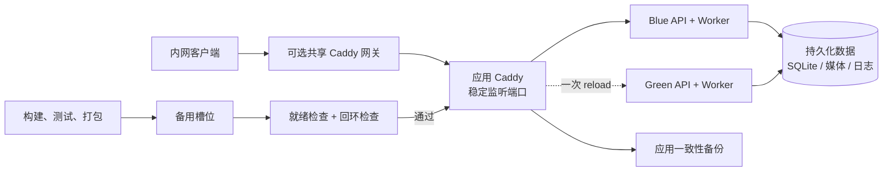

# Windows 内网部署 Skill

[English](README.md) | [简体中文](README.zh-CN.md)

在 Windows 11 或 Windows Server 上，为 Node.js、Next.js 和 Vite 应用提供可重复的蓝绿发布、健康检查切流和一键回滚能力。

本项目把通常散落在一次性部署脚本中的运维经验，整理成可版本化、归属于项目自身的 PowerShell Skill。团队可以用它完成从项目审计、安装、发布、回滚，到备份和交接的完整流程；生产环境不依赖 Codex，也不要求 Linux 或容器平台。

**适用场景：** 内部工具、工厂看板、业务系统，以及其他需要在企业内网 Windows 主机上稳定运行的 Node.js 服务。

> **定位说明：** 这是单主机部署韧性方案，不是机器级高可用。它可以降低因发布造成的中断，但无法消除主机断电、磁盘、操作系统或网络故障风险。

## 能力概览

| 关注点 | 本项目的方案 |
| --- | --- |
| 发布策略 | 蓝绿槽位 + 不可变发布目录 |
| 流量入口 | Caddy 稳定监听端口，可选共享域名网关 |
| 进程管理 | WinSW 将 API 和 Worker 注册为 Windows 服务 |
| 切流条件 | 就绪健康检查 + 仅允许回环地址监听 |
| 故障恢复 | 保留回滚目标、记录切流后告警、提供状态命令 |
| 数据安全 | 持久化数据与发布目录分离，约束应用一致性备份 |
| 配置管理 | 版本化 JSON Schema、严格校验、工具哈希固定 |

## 适合谁使用

- **应用团队：** 需要可预测的 Windows 发布路径，但不想自行维护整套平台。
- **IT/运维团队：** 希望明确管理服务名、端口、防火墙范围、备份归属和恢复步骤。
- **面试官和评审者：** 关注候选人是否能处理失败路径，而不只是编写 happy path 脚本。

## 解决的问题

- **可重复的 Windows 运维：** 使用确定性的 PowerShell 命令，替代交互式且不可追溯的服务器改动。
- **接近零停机的发布：** 在备用蓝绿槽位完成构建和健康检查后，通过一次 Caddy reload 切换流量。
- **快速且可解释的回滚：** 不可变发布目录和槽位 junction 保留上一个已知可用版本。
- **清晰的服务边界：** Caddy 作为稳定入口，WinSW 管理 API 和 Worker Windows 服务。
- **数据与密钥隔离：** 应用数据、上传文件、日志、备份和密钥均位于发布目录之外。
- **多应用共存：** 每个应用使用唯一的回环 Caddy 管理端口，也可向独立维护的共享网关发布域名路由。
- **可观测的安全护栏：** 提供 preflight、配置校验、操作锁、回环监听校验、内存守护、状态告警和恢复演练指引。

## 架构



每个发布版本都会复制到不可变目录。`blue/current` 或 `green/current` junction 指向槽位中的版本，活动状态单独记录。切流完成后，旧槽位会排空并保留为回滚目标。

## 核心流程

1. **审计：** 识别目标项目的框架、入口、健康检查候选、构建产物和持久化存储信号。
2. **脚手架：** 生成归属于项目自身的 `deploy/windows` 部署包和运维 Runbook。
3. **定制与校验：** 按应用真实的命令、路径、端口、健康接口和数据契约修改并校验 `deployment.config.json`。
4. **Preflight：** 检查权限、端口占用、唯一 Caddy 管理端口、工具可用性，以及计划中的防火墙/电源设置变更。
5. **安装：** 安装带哈希校验的 Caddy 和 WinSW，注册服务与计划任务，并完成首次受控切流。
6. **发布：** 将后续版本发布到备用槽位，执行测试/构建/安装，等待就绪后一次 reload Caddy，再排空旧槽位。
7. **运维：** 使用 `status.ps1`、`backup.ps1`、`rollback.ps1` 和生成的 Runbook 完成日常操作。

## 快速开始

下面的审计、脚手架、迁移和校验命令从本 Skill 仓库执行，并通过参数指向目标应用。这些脚本不会被复制到目标应用；`scaffold-project.ps1` 会将运行时部署包复制到 `deploy/windows`。安装会修改主机状态，必须在目标 Windows 主机的管理员 PowerShell 中执行。

```powershell
# 在本 Skill 仓库中执行
Set-Location C:\src\deploy-windows-intranet

# 1) 审计应用
.\scripts\audit-project.ps1 -ProjectRoot C:\src\my-app

# 2) 生成部署包和 Runbook
.\scripts\scaffold-project.ps1 -ProjectRoot C:\src\my-app -AppName "My Intranet App"

# 3) 编辑 C:\src\my-app\deploy\windows\deployment.config.json
#    以及 docs\WINDOWS_INTRANET_DEPLOYMENT.md

# 4) 校验配置和引用文件
.\scripts\validate-project.ps1 -ProjectRoot C:\src\my-app

# 5) 查看主机变更并解决所有阻断项
& C:\src\my-app\deploy\windows\preflight.ps1 -ConfigPath C:\src\my-app\deploy\windows\deployment.config.json

# 6) 安装服务、Caddy、计划任务并发布首个版本
& C:\src\my-app\deploy\windows\install.ps1 -ConfigPath C:\src\my-app\deploy\windows\deployment.config.json -ProjectRoot C:\src\my-app
```

完成脚手架后，生成的部署包是自包含的。运维人员无需保留本 Skill 仓库，即可在应用仓库中运行 `preflight.ps1`、`install.ps1`、`deploy.ps1`、`rollback.ps1`、`status.ps1` 和 `backup.ps1`。

常规代码发布：

```powershell
.\deploy\windows\deploy.ps1 -ConfigPath .\deploy\windows\deployment.config.json -ProjectRoot .
.\deploy\windows\status.ps1 -ConfigPath .\deploy\windows\deployment.config.json
```

只有在风险经过确认并记录到 Runbook 时，才使用 `-AllowDirty` 或 `-SkipTests`。如果修改了配置或服务，应通过 `install.ps1` 发布，以便同步清理废弃服务和计划任务。

## 会生成什么

运行 `scaffold-project.ps1` 会在应用仓库中生成两个由项目管理的产物：

| 产物 | 作用 |
| --- | --- |
| `deploy/windows/` | 版本化部署运行时、配置、Caddy/WinSW 集成、健康检查、回滚、备份和状态工具 |
| `docs/WINDOWS_INTRANET_DEPLOYMENT.md` | 面向人的 Runbook，记录真实路径、URL、负责人、维护窗口、备份目标和恢复步骤 |

将这些文件与应用代码一起纳入版本控制，可以让部署行为可审查、可复现，并且受变更流程管理。

## 配置要点

`deployment.config.json` 使用 Schema 版本管理并纳入源码控制，内容包括：

- 带 SHA-256 哈希的 Caddy 和 WinSW 固定版本；
- 测试、构建、依赖安装和发布复制命令；
- 稳定监听端口以及每个 API 槽位的端口；
- API 健康路径、路由归属、绑定地址环境变量和优雅停止超时；
- 持久化根目录与允许来源环境变量；
- Worker 内存上限和持续阈值 Memory Guard 策略；
- 可选的应用一致性备份命令和计划；
- 允许的防火墙远端地址及 AC 电源策略。

密钥通过机器级环境变量引用（例如 `%APP_DATABASE_URL%`），不会以明文写入 JSON 或 WinSW XML。

## 可靠性与安全模型

- **健康检查切流：** API 必须返回表示就绪的 2xx 响应，并且只监听 `127.0.0.1`/`::1`。
- **原子路由变更：** 静态前端和 API 路由在一次经过校验的 Caddy reload 中切换。
- **回滚保护：** 切流前失败会恢复原备用槽位 junction；切流后排空失败会持久化为明确告警。
- **并发控制：** 安装、发布和回滚通过以规范化生产根目录为键的主机级互斥锁串行执行。
- **服务隔离：** 每个 API/Worker 都是独立的 WinSW 服务；通配地址或面向局域网的槽位监听会被拒绝。
- **供应链校验：** 只有通过固定 SHA-256 哈希校验的 Caddy/WinSW 二进制才会被接受。
- **最小网络暴露：** 拒绝 `Any`、`0.0.0.0/0`、`::/0` 等全局防火墙范围。
- **恢复纪律：** SQLite 必须使用 SQLite backup API 或应用备份接口；不接受对在线数据库进行未经协调的文件复制。

## Schema 迁移

Schema v1 部署包可以安全迁移到 v2：

```powershell
# 先执行 dry run
.\scripts\migrate-schema-v1-to-v2.ps1 -ProjectRoot C:\src\my-app

# 仅在 Git 工作区干净时应用；会创建 ZIP 备份
.\scripts\migrate-schema-v1-to-v2.ps1 -ProjectRoot C:\src\my-app -Apply
```

迁移会为 API 服务增加 `bindAddressEnvironment`、同步运行时脚本、校验结果；如果写入后的校验失败，会自动恢复项目文件。迁移不会安装服务，也不会修改主机设置。

## 验证

修改 Skill 或生成的部署资产后，运行隔离回归测试：

```powershell
.\scripts\test-skill.ps1
```

测试覆盖脚手架、Schema 迁移、配置拒绝、PowerShell 语法解析、回环隔离、操作锁、进程树内存统计、槽位 junction 切换、告警持久化和废弃服务检测。生产验收仍需实际运行计划备份并完成隔离恢复演练，详见 [`references/acceptance-checklist.md`](references/acceptance-checklist.md)。

想安全地快速了解项目时，可以先运行 `scripts/test-skill.ps1`：它只使用临时隔离 fixture，不会安装服务、开放防火墙端口或修改主机电源设置。

## 仓库结构

| 路径 | 用途 |
| --- | --- |
| [`SKILL.md`](SKILL.md) | 范围、流程、运行规则和交接要求 |
| [`assets/windows-blue-green/`](assets/windows-blue-green/) | 项目运行时脚本和配置模板 |
| [`scripts/audit-project.ps1`](scripts/audit-project.ps1) | 只读项目盘点 |
| [`scripts/scaffold-project.ps1`](scripts/scaffold-project.ps1) | 生成 `deploy/windows` 和 Runbook |
| [`scripts/validate-project.ps1`](scripts/validate-project.ps1) | 校验生成包和引用文件 |
| [`scripts/migrate-schema-v1-to-v2.ps1`](scripts/migrate-schema-v1-to-v2.ps1) | 可恢复的 Schema/运行时迁移 |
| [`scripts/test-skill.ps1`](scripts/test-skill.ps1) | 隔离回归测试 |
| [`references/deployment-contract.md`](references/deployment-contract.md) | 应用和配置契约 |
| [`references/acceptance-checklist.md`](references/acceptance-checklist.md) | 安装、发布、回滚和恢复验收门槛 |
| [`references/shared-gateway.md`](references/shared-gateway.md) | 多应用安全域名路由 |

## 范围与取舍

本项目明确面向 Windows 11/Windows Server、Node.js、Caddy 和 WinSW。它不是 Kubernetes、Docker、仅 IIS、Linux 或多主机高可用方案。需要这些平台的团队应创建独立的平台模板，而不是削弱当前契约。

设计优先保证运维人员看得见真实状态，而不是依赖“魔法”：跳过测试、禁用备份、脏工作区发布、未解决的切流后告警和缺少恢复演练，都会被标记为必须确认并记录的风险。

## 面试官关注点

这个仓库展示的不只是一个部署脚本，而是将部署建模为一组契约和状态转换。最能体现工程能力的是失败路径：

- 候选版本在切流前失败时，仍保留上一个可回滚目标；
- 在共享 Windows 主机上防止服务、端口、监听地址和 Caddy 管理端口冲突；
- 将持久化数据与不可变发布目录分离，避免回滚改写业务状态；
- 校验真实进程归属和回环绑定，而不是只相信配置文件；
- 将 `-SkipTests`、脏发布、禁用备份等捷径显式记录为风险。

这体现的是运维判断力：可靠性来自契约、可观察状态和可恢复动作，而不是对理想 happy path 的假设。
